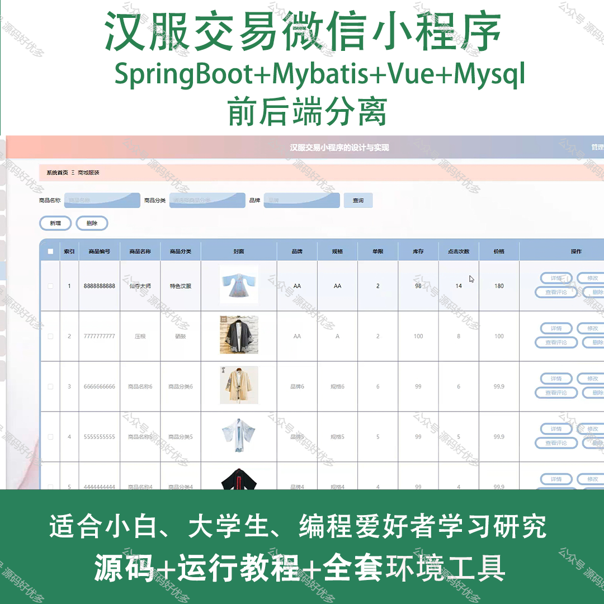
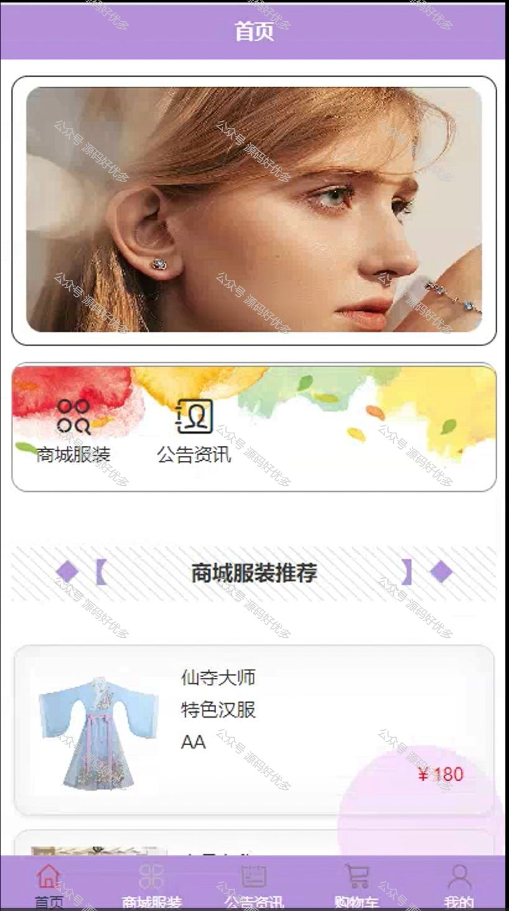
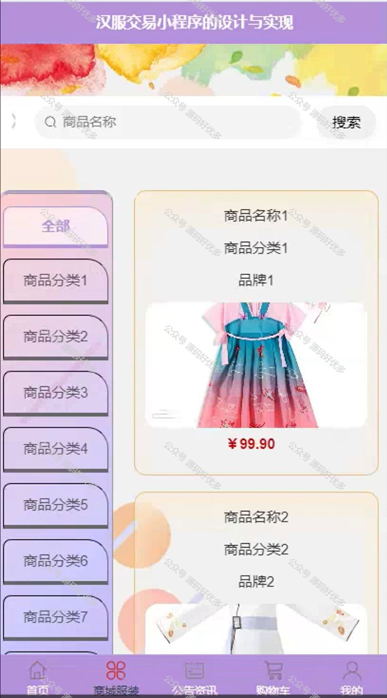
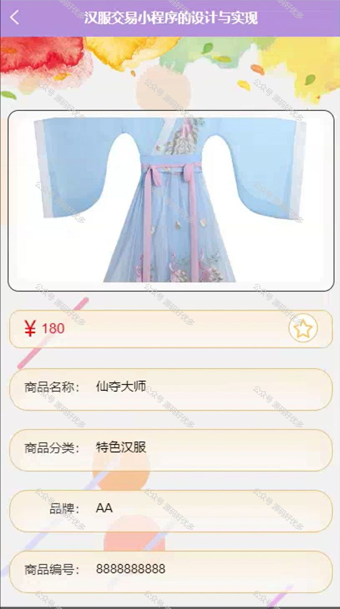
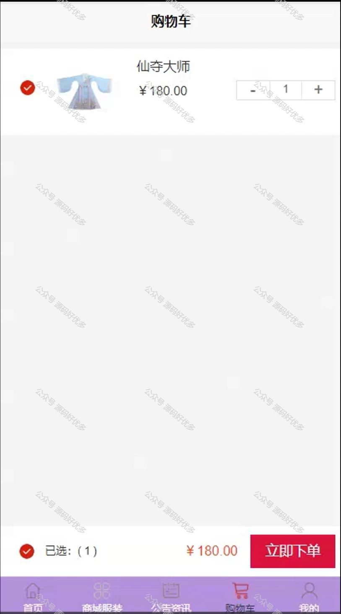
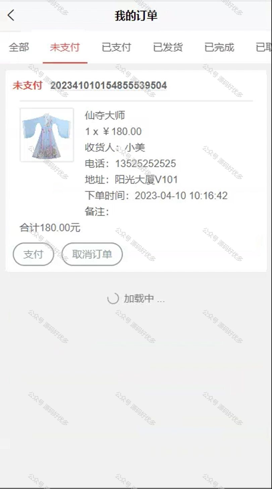
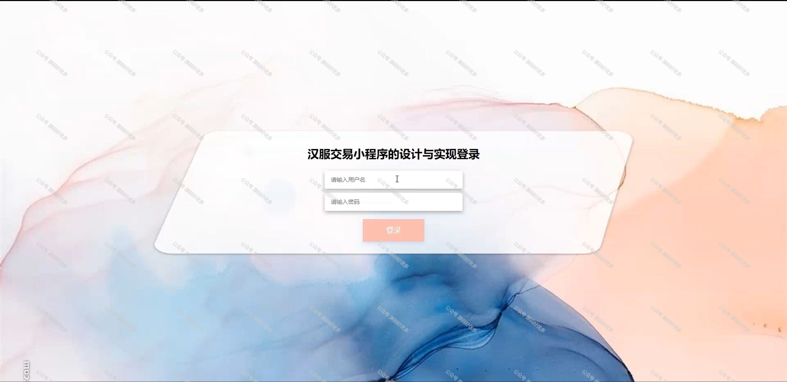
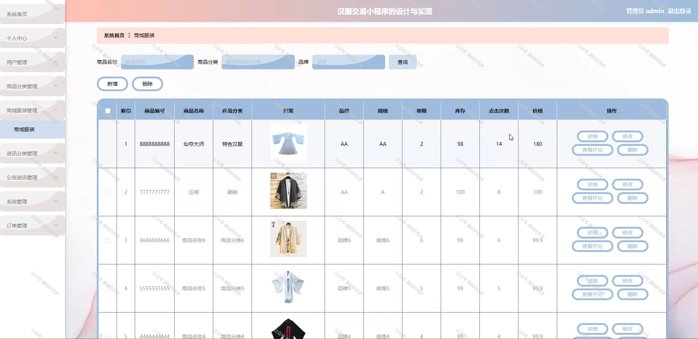
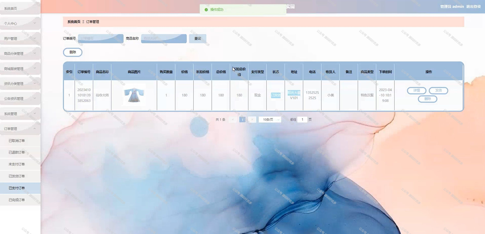

 
## 查看主页获取源码

> **作者介绍**： **✌**全网粉丝10W+本平台特邀作者、博客专家、CSDN新星计划导师、java领域优质创作者,博客之星、掘金/华为云/阿里云/InfoQ等平台优质作者、专注于项目实战 **✌**

  

### 一、作品包含

源码+数据库+全套环境和工具资源+部署教程

### 二、项目技术

前端技术：Html、Css、Js、Vue、Element-ui

数据库：MySQL

后端技术：Java、Spring Boot、MyBatis

  

### 三、运行环境

开发工具：IDEA/eclipse + 微信开发者工具

数据库：MySQL5.7

数据库管理工具：Navicat10以上版本

环境配置软件： JDK1.8+Maven3.6.3

前端Nodejs：14

### 四、项目介绍
项目编号：mpweixinA030

汉服交易微信小程序是一款专注于汉服文化推广与交易的移动平台，旨在为汉服爱好者提供一个便捷、专业的交流与购物环境。通过这款小程序，用户可以浏览和购买各式各样的汉服产品，了解汉服的历史文化背景。小程序的推出，不仅满足了汉服爱好者对传统服饰的需求，也促进了汉服文化的传播和创新发展，为传统文化与现代生活搭建了一座桥梁。

前台用户功能：首页、商城服装、公告资讯、购物车、个人中心、我的收藏管理、用户充值、在线客服、购物车、我的订单。

后台管理员的功能：系统首页、个人中心、用户管理、商品分类管理、商品服装管理、资讯分类管理、公告资讯管理、系统管理、订单管理。

### 五、运行截图

  
